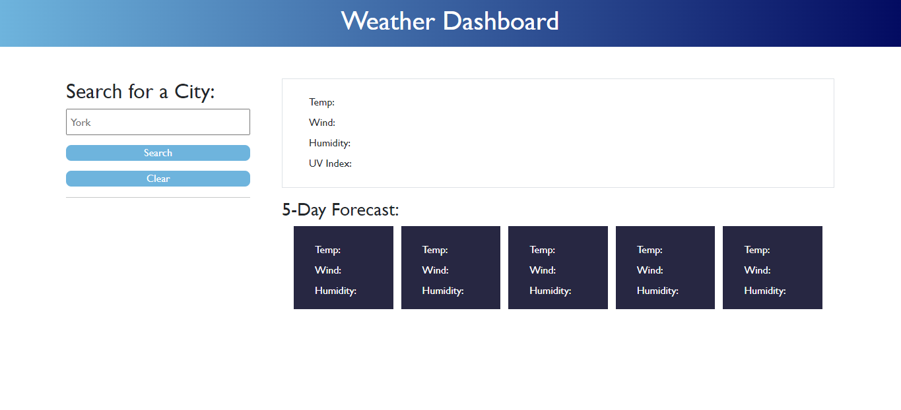
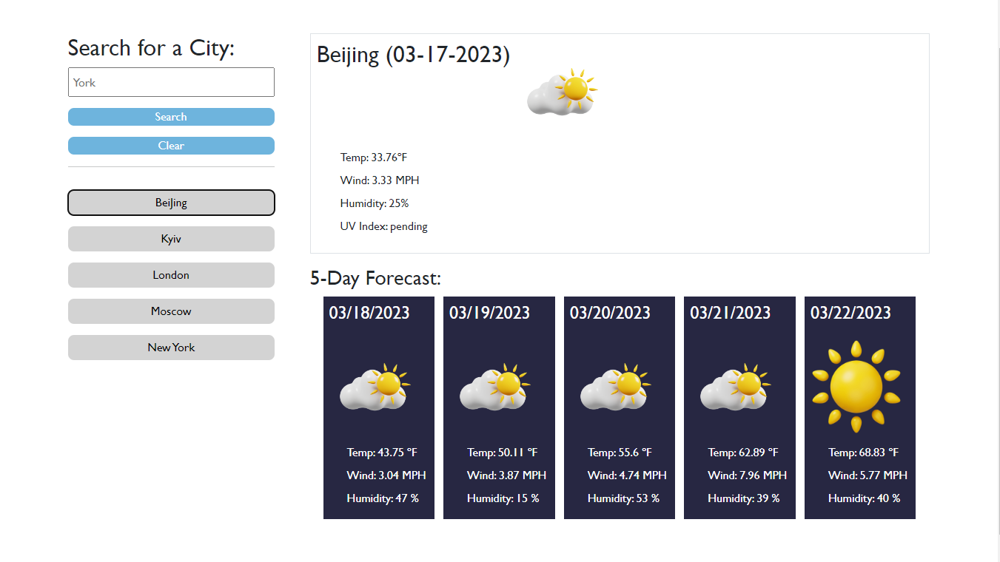
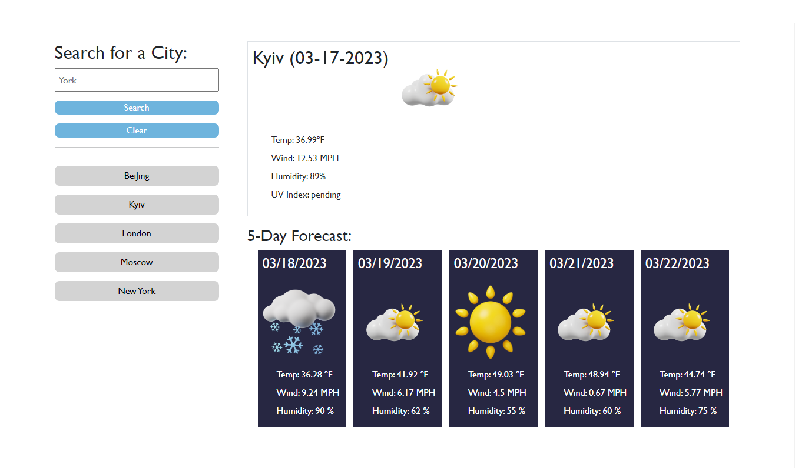
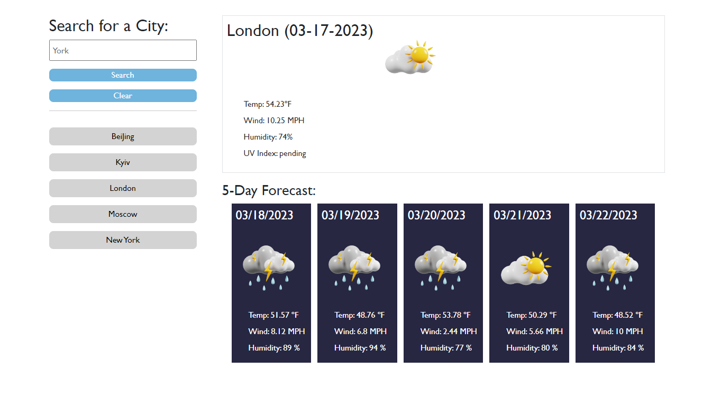
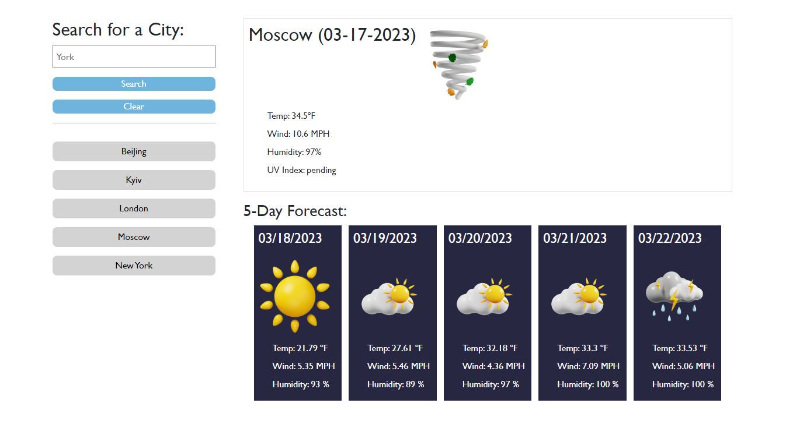
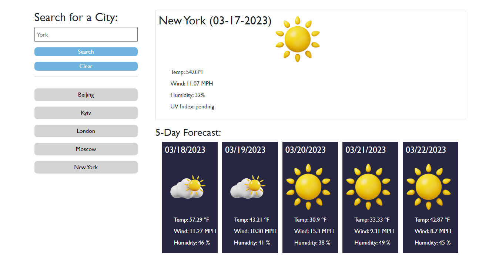

# Weather-Forecast

AS A traveler, I WANT to see the weather outlook for multiple cities, SO THAT I can plan a trip accordingly.
 
I have created a weather dashboard with form inputs. It will run in the browser and feature dynamically updated HTML and CSS.
 
When a user searches for a city they are presented with current and future conditions for that city and that city is added to the search history. 
 
When a user views the current weather conditions for that city they are presented with:
<ul>
<li>
The city name
</li>
<li>
The date
</li>
<li>
An icon representation of weather conditions
</li>
<li>
The temperature
</li>
<li>
The humidity
</li>
<li>
The wind speed
</li>
</ul>

 
When a user views future weather conditions for that city they are presented with a 5-day forecast that displays:
<ul>
<li>
The date
</li>
<li>
An icon representation of weather conditions
</li>
<li>
The temperature
</li>
<li>
The humidity
</li>
</ul>

 
When a user clicks on a city in the search history they are again presented with current and future conditions for that city. 
 
When a user clicks on the clear button all the search history are erased from the user interface and the local storage.

 
The following images show the web application's appearance and functionality:

